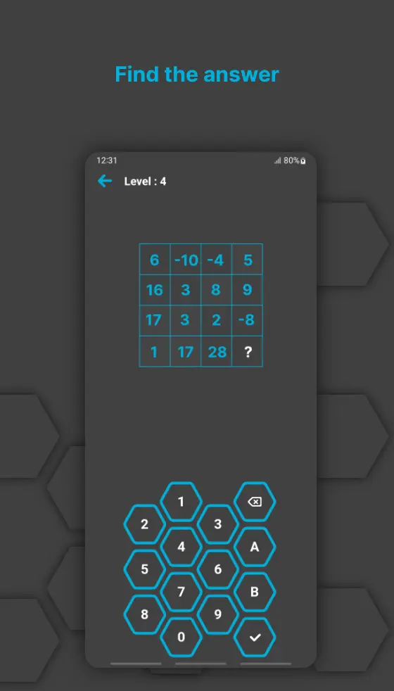
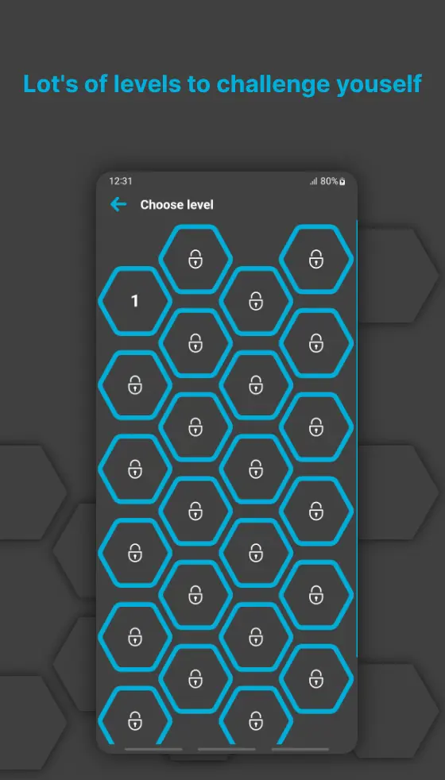
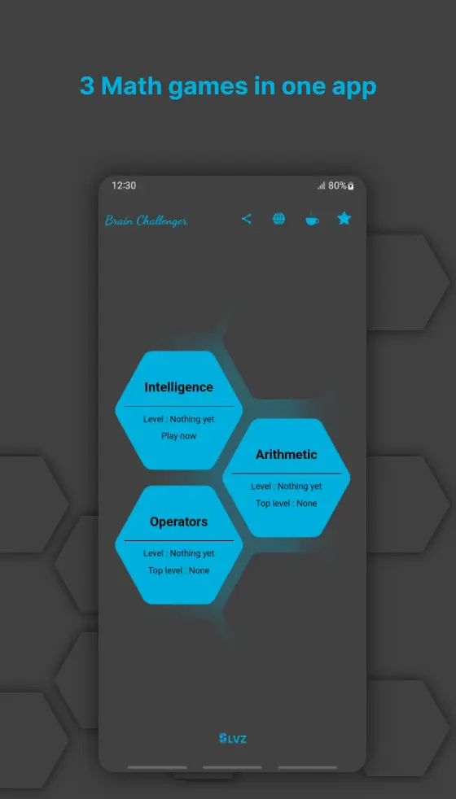

# 🧠 Brain Challenger – Math Game for Mind Training

**Brain Challenger** is a simple yet effective brain training game designed for both kids and adults. It features three fun math-based mini-games aimed at improving focus, memory, and arithmetic skills — and even helps prevent Alzheimer’s disease.

---

## 📲 Download

- [Google Play](https://play.google.com/store/apps/details?id=com.slvz.brainchallenger)
- [SLVZ App Store](https://apps.slvz.dev/android/com.slvz.brainchallenger)
- [Cafe Bazaar](https://cafebazaar.ir/app/com.slvz.brainchallenger)
- [Myket](https://myket.ir/app/com.slvz.brainchallenger)

---

## 🎮 Game Modes

1. **Example-based Answering**  
   Understand the given example and use it to solve similar math problems.

2. **Equation Solving**  
   Basic arithmetic operations – test how fast you can solve them.

3. **Guess the Operator**  
   You're given the answer and numbers – can you guess the correct operator?

---

## ✅ Features

- Three unique math game modes  
- Designed to improve brain performance and memory  
- Works offline – no internet required  
- No data collection or tracking  
- 100% ad-free experience  
- Lightweight and fast

---

## 📸 Screenshots

  
  

---

## ⚙️ Tech Stack

- Language: C# / MAUI Blazor hybrid  
- Platform: Android  
- Minimum Android Version: 8.0 (Oreo)

---

## 📦 Installation

You can install the app directly from [Google Play](https://play.google.com/store/apps/details?id=com.slvz.brainchallenger) or download the APK from [SLVZ App Store](https://apps.slvz.dev/android/com.slvz.brainchallenger).

---

## 📝 License

This project is licensed under the MIT License. See the [LICENSE](LICENSE) file for more details.

---

## 🙌 Contributing

Contributions are welcome! If you have suggestions for improvements, feel free to:

- Fork the repo  
- Create a new branch  
- Submit a Pull Request  
- Or open an Issue for bugs/ideas

---

## 📬 Contact

For questions or suggestions:

- Email: [ashkan.slvz@outlook.com](mailto:ashkan.slvz@outlook.com)  
- Website: [slvz.dev](https://slvz.dev)

---

Thanks for checking out Brain Challenger! 😊
